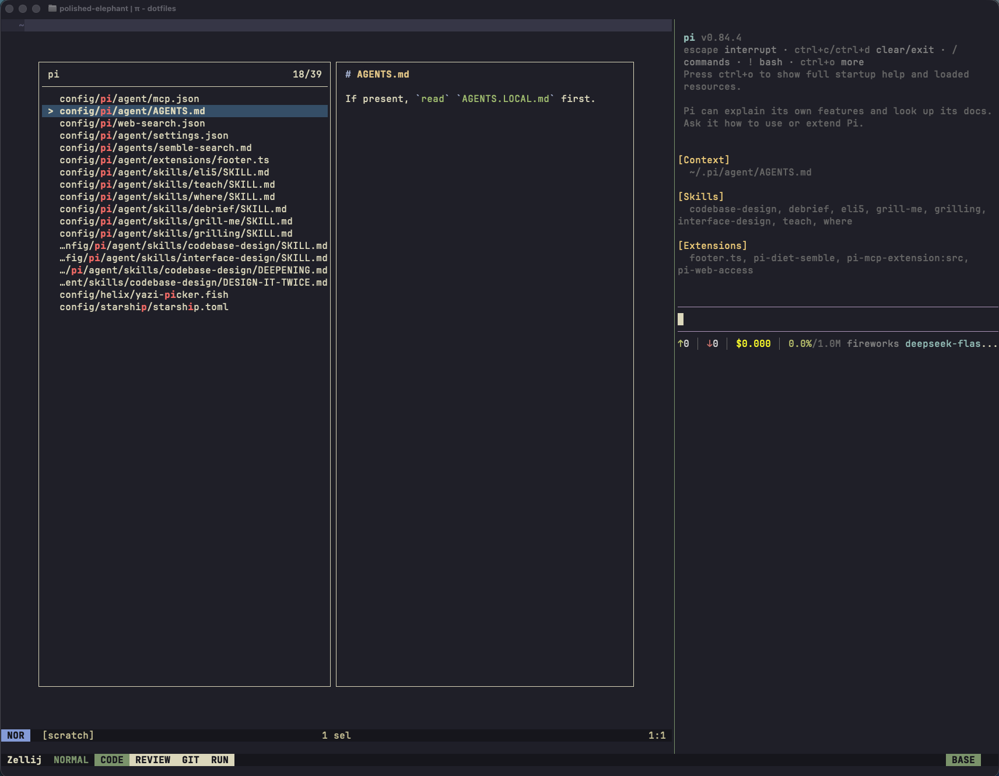

# Dang Thanh’s dotfiles



## Getting Started

You need to install [Git](https://git-scm.com/). Clone or [download](https://github.com/dangvanthanh/dotfiles/archive/master.zip) this repository

```shell
git clone https://github.com/dangvanthanh/dotfiles.git
```

### Usage

- `$ cd dotfiles`
- `$ chmod +x install.sh`
- `$ ./install.sh`

## Git

Set Git global configuration

```shell
git config --global user.name "Your Name"
git config --global user.email "youremail@email.com"
```

## Fish

Make `fish` default shell

```shell
which fish
chsh -s /opt/homebrew/bin/fish
```

## Homebrew

Install Homebrew and Brewfile

```shell
chmod +x brew.sh
./brew.sh
./install.sh
```

## Configuration

Create `~/.config` folder for configuration

```shell
mkdir ~/.config && cd ~/.config
```

### Ghostty

Create configuration for Ghostty

```shell
mkdir -p ~/.config/ghostty && touch ~/.config/ghostty/config
```

### Starship

Create configuration for Starship

```shell
mkdir -p ~/.config && touch ~/.config/starship.toml
```

## Brewfile

All the applications I use:

### Web Developer

- [Ghostty](https://ghostty.org/) - macOS Terminal Replacement
- [Helix](https://helix-editor.com/) - Post-modern Text Editor
- [TablePro](https://tablepro.app/) - The database client for Mac

### TUI

- [GitUI](https://github.com/gitui-org/gitui) - Fast Terminal UI for Git
- [Posting](https://github.com/darrenburns/posting) - The API Client that Lives in Your Terminal

### Browsers

- [Firefox](https://www.mozilla.org/en-US/firefox/new/) - Fast, Private and Free
- [Google Chrome](https://www.google.com/chrome/) - Download the Fast, Security Browser

### Design

- [Figma](https://www.figma.com/) - The Collaborative Interface Design Tool
- [Blender](https://www.blender.org/) - Free 3D Creation
- [Inkscape](https://inkscape.org/) - Draw Freely
- [Darktable](https://darktable.org/) - The Easy Way to Make Great Photos

#### Communication

- [Discord](https://discord.com/) - Your Place to Talk and Hang Out
- [Microsoft Team](https://www.microsoft.com/en-us/microsoft-teams/group-chat-software) - Streamline Communications
- [Dropbox](https://www.dropbox.com/) - Storage Online

#### Others

- [Raycast](https://www.raycast.com/) - Blazingly Fast, Totally Extendable Launcher
- [Asciinema](https://asciinema.org/) - Record And Share Terminal
- [Rectangle](https://rectangleapp.com/) - Move And Resize Windows
- [Ice](https://icemenubar.app/) - Menu Bar Management
- [NordVPN](https://nordvpn.com/) - Online VPN Service for Speed
- [Keka](https://www.keka.io/) - Unarchive Files
