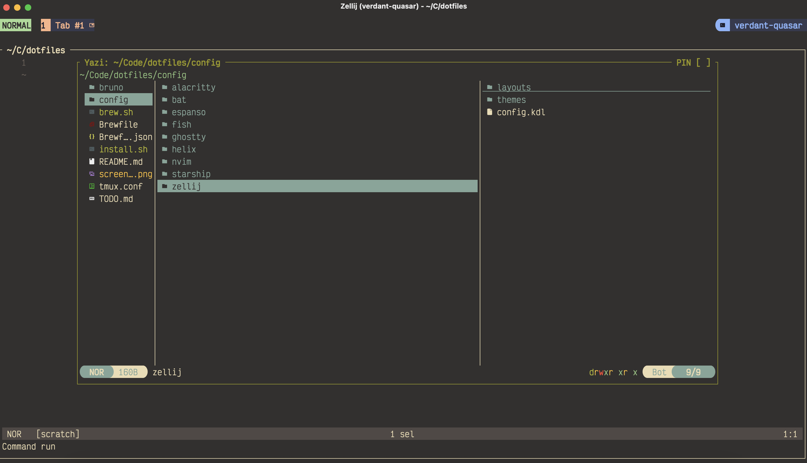

# Dang Thanh’s dotfiles



## Getting Started

You need install [Git](https://git-scm.com/). Clone or [download](https://github.com/dangvanthanh/dotfiles/archive/master.zip) this repository

```shell
$ git clone https://github.com/dangvanthanh/dotfiles.git
```

### Usage

- `$ cd dotfiles`
- `$ chmod +x install.sh`
- `$ ./install.sh`

## Homebrew

Install Homebrew and Brewfile

```shell
$ ./brew.sh
```

### Brewfile

All the applications I use

- [Google Chome](https://www.google.com/chrome/) - Chrome Web Browser
- [Firefox](https://www.mozilla.org/en-US/firefox/new/) - Free Web Browser
- [Asciinema](https://asciinema.org/) - Record And Share Terminal
- [Iterm2](https://www.iterm2.com/) - macOS Terminal Replacement
- [Neovim](https://github.com/neovim/neovim) - Powerful Editor
- [Visual Studio Code](https://code.visualstudio.com/) - Code Editor
- [Sequel Pro](https://www.sequelpro.com/) - Database Management For MySQL
- [Dash](https://kapeli.com/dash) - API Documentation
- [Blender](https://www.blender.org/) - Free 3D Creation
- [Inkscape](https://inkscape.org/en/) - Draw Freely
- [Teamviewer](https://www.teamviewer.com/en/) - Remote Desktop
- [Dropbox](https://www.dropbox.com/) - Storage Online
- [Skype](https://www.skype.com/en/) - Communication Calls And Chat
- [Spectacle](https://www.spectacleapp.com/) - Move And Resize Windows
- [Keycastr](https://github.com/keycastr/keycastr) - Keystoke Visualizer
- [Karabiner](https://pqrs.org/osx/karabiner/) - Keyboard Remapping

## Oh My ZSH

```shell
$ sh -c "$(curl -fsSL https://raw.githubusercontent.com/robbyrussell/oh-my-zsh/master/tools/install.sh)"
```

- [Powerline](https://github.com/powerline/powerline) - Provides Statusline And Prompts
- [Powerline-shell](https://github.com/b-ryan/powerline-shell) - Beautiful And Useful Prompts

## Git

Set Git global configuration

```shell
$ git config --global user.name "Your Name"
$ git config --global user.email "youremail@email.com"
```
