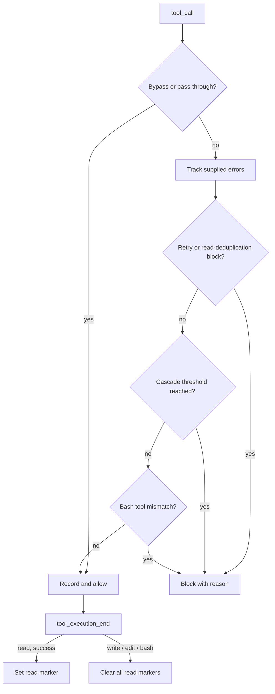

# Agent Harness

Runtime tool-call validation for Pi: redirect mismatched bash commands, discourage same-tool cascades, and block redundant reads before execution.

## Install

Place this directory in `~/.pi/agent/extensions/agent-harness/` for global use or `.pi/extensions/agent-harness/` for project-local use. Pi discovers `index.ts` automatically; use `/reload` after changes. Project-local extensions require project trust.

Requires Pi Coding Agent with `isProjectTrusted()` support (≥ 0.79.1). No external runtime dependencies beyond Pi.

## How it works

`index.ts` registers five handlers:

- `session_start`: create fresh state and default rules, then load trusted project configuration using `ctx.cwd`. Loading failures keep defaults and produce a UI warning or stderr message.
- `turn_start`: increment the session turn, reset cascade counters, and remove one oldest error per tool.
- `tool_call`: validate the call; return a blocking reason or allow execution.
- `tool_execution_end`: record read markers (successful reads only) and clear markers after any `write`, `edit`, or `bash` completion.
- `session_compact` / `session_tree`: reset harness state — read outputs from before a compaction or branch switch are no longer in the active context.

### Validation Pipeline

Guards run in this order; bypassed and pass-through calls return early:

0. **Force bypass** — `_harness.force: true` or a bash `# bypass-harness` comment skips guards unless `hasUI` is explicitly `false`.
1. **Pass-through** — Default exemptions: `ask_user`, `structural_search`, and `ripgrep_search`.
2. **Error tracking** — The class records incoming `isError` flags by tool name. See the runtime limitation below.
3. **Cache invalidation** — Any `write`, `edit`, or `bash` call clears the entire read cache. Shell commands can mutate files in ways a classifier cannot see (scripts, git, bypasses), so every bash call invalidates.
4. **Error retry guard** — Two accumulated errors for a tool block subsequent non-error calls, regardless of arguments.
5. **Read deduplication** — A repeated raw path+offset+limit can be blocked across turns. Markers are recorded in `tool_execution_end`, so only reads that actually succeeded block repeats. Same-turn reads and calls with `hasUI: false` pass.
6. **Cascade detection** — The eighth consecutive call is blocked by default. Reads are exempt; bash commands are grouped by subcommand.
7. **Tool mismatch** — Standalone search/read commands in bash are redirected to dedicated tools, but only when the target tool is currently active.

Allowed calls count toward cascades; blocked calls do not. Bypassed calls count but cannot themselves be blocked. Changing tool or bash subcommand starts a new consecutive chain.



### Tool Mismatch Detection

`lib/bash-query.ts` classifies commands; `getBashSubKey()` groups commands for cascade counting, not mismatch detection.

| Pattern                    | Detected By        | Redirect To      |
| -------------------------- | ------------------ | ---------------- |
| Standalone `grep`          | `isBashSearch()`   | `ripgrep_search` |
| Standalone `rg`            | `isBashSearch()`   | `ripgrep_search` |
| Standalone `cat`           | `isBashFileRead()` | `read`           |
| Standalone `less` / `more` | `isBashFileRead()` | `read`           |

A redirect fires only when the target tool is in `pi.getActiveTools()`; otherwise the bash call passes, so the harness never redirects to a tool the model cannot call. Pipelines and chained commands such as `ls \| grep foo` and `cd src && rg foo` pass this mismatch guard. `head`, `tail`, `find`, and `ls` are not redirected. Output redirections such as `cat > file` are not treated as file reads.

### Key Design Decisions

- **Configurable thresholds:** default cascade threshold 8; `web_crawl` defaults to 20. Explicit per-tool thresholds override the global fallback.
- **Read markers, not cached content:** the cache stores turn/timestamp metadata, not file contents. A blocked read returns a reason, not the earlier output. Markers are set only after a read executes successfully and expire after six turns or 30 seconds; the marker map is capped at 512 entries.
- **Invalidation on completion, not classification:** `write`/`edit`/`bash` completions clear all markers, including bypassed calls. Classifying which shell commands mutate files is unreliable; blanket invalidation is cheap.
- **Session isolation:** every session start replaces both state and rules. `/reload` picks up configuration changes. Compactions and tree navigation reset state, because earlier read outputs leave the active context.
- **Trust gate:** project configuration is honored only when `isProjectTrusted()` returns true.
- **Best-effort workflow guard:** this is not a security sandbox or a user-approval mechanism.

## Configuration

Create `.pi/harness-config.json` in the session working directory:

```json
{
	"cascadeThreshold": 8,
	"toolMeta": {
		"bash": { "cascadeThreshold": 4 },
		"web_crawl": { "cascadeThreshold": 20 },
		"ask_user": { "passThrough": true }
	}
}
```

Supported top-level keys are `cascadeThreshold` and `toolMeta` (not `tools`). Per-tool overrides merge with built-in metadata. Unknown top-level keys cause loading to fail and the entry point to retain defaults. Missing or untrusted configuration uses defaults.

## Force Bypass

| Signal                     | Scope                                   | Example                                                    |
| -------------------------- | --------------------------------------- | ---------------------------------------------------------- |
| `_harness.force: true`     | Any tool whose schema permits the field | `{ "command": "grep foo", "_harness": { "force": true } }` |
| `# bypass-harness` comment | Bash                                    | `grep foo # bypass-harness`                                |

- `hasUI: false` disables both signals. The current class treats missing `hasUI` as enabled; Pi supplies this field in real contexts. UI availability is not proof of user authorization.
- `_harness` is consumed and removed before tool execution, even when bypass is rejected or `force` is false. Tool schema validation happens before `tool_call`, so this field cannot bypass schema rejection.
- The bash annotation parser ignores quoted strings and examines the first logical line. Heredocs and line continuations are best-effort cases; the field form is an alternative where the tool schema accepts it.
- Bypass returns before cache invalidation as well as blocking guards.

## Architecture

```text
├── index.ts                  # Pi event wiring and configuration initialization
├── agent-harness.ts          # AgentHarness and getBashSubKey
├── lib/
│   ├── bash-query.ts         # Bash classification and bypass parsing
│   ├── harness-rules.ts      # Defaults, tool metadata, redirect messages
│   ├── harness-state.ts      # State factory, error tracker, counters, read markers
│   ├── load-config.ts        # Trusted project configuration loader
│   └── timed-map.ts          # TTL storage
└── test/                     # Harness integration and documentation checks
```

Library tests live alongside their modules in `lib/`.

### HarnessState Internals

`createHarnessState()` returns an object, not a class:

- `readCache`: raw path+offset+limit keys mapped to `{ turn, timestamp }` markers with dual TTL, capped at 512 entries. Written from `tool_execution_end` (successful reads only), cleared by any `write`/`edit`/`bash` completion.
- `errorTracker`: up to three error entries per tool; one oldest entry decays at each turn boundary.
- `callCounter`: consecutive counts keyed by tool name and optional bash subcommand; reset at turn boundaries.
- `toolCallIndex`: increments for every handled call.
- `sessionTurn`: increments at each `turn_start`.

### Known Runtime Limitations

- Pi's `tool_call` event does not include `isError`, and this extension does not subscribe to tool-result events. The class's error-retry guard is tested with synthetic errors but is not wired to real execution failures.
- Any bash completion clears read markers, including commands that changed nothing — the guard trades a possible redundant read for never trusting a stale marker.
- Bash classification is heuristic, not a complete shell parser. Mismatch redirects require the target tool to be active; if it is not, the bash call passes through.

## Testing

From the repository root:

```sh
node --test config/pi/agent/extensions/agent-harness/lib/*.test.ts config/pi/agent/extensions/agent-harness/test/*.test.*
node --test config/pi/agent/extensions/check.mjs
```

Coverage includes guard decisions, bash classification, read-marker TTL and invalidation, synthetic error tracking and decay, cascades, bypass semantics, trusted configuration, session initialization, timed-map operations, plus cross-extension integration checks (execution-end markers, compaction/tree resets, activeTools gating).